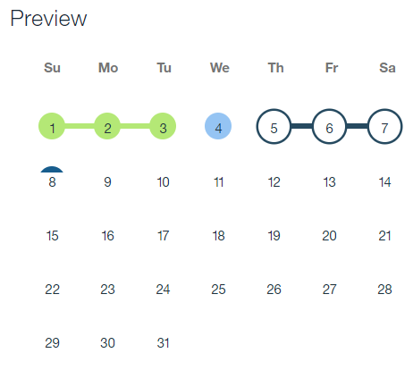
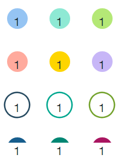

---

copyright:
 years: 2017

lastupdated: "2017-5-24"

---

{:new_window: target="_blank"}
{:shortdesc: .shortdesc}
{:screen:.screen}
{:codeblock:.codeblock}

# Managing calendar events and tags
{: #events_overview}

A calendar event represents a release-related activity that you manage with the calendar.

A tag is a label that you can use to manage release event statuses and categories. Unlike calendar events, tags do not appear on the calendar.

{:shortdesc}

Calendar events are organized into general categories that include releases, holidays, and maintenance windows. [Calendar events and tags are assigned to releases](UCCR_releases.html#releases_overview). When a calendar event is assigned, it is represented on the calendar by an icon appropriate for the event category. You can use the icons to filter the Releases page and select releases for any affected date or range of dates.

Like calendar events, tags are assigned to release events and can be used to filter the Releases page. Assigned tags appear in Releases page **Tags** column but they do not appear on the calendar. You can use tags to avoid calendar clutter.

## Filtering release events and deployment plans

{: #events_findFilter}

The Releases page displays the releases and deployment plans that are created by you and your teams. From the Releases page, you can do most release-related activities, such as creating releases and deployment plans.

By default, the Releases page displays releases and deployments that are scheduled for the next seven days. You can filter the display by time, calendar event, tag, and status. For example, you might restrict the display to releases that are scheduled for tomorrow. The currently selected date range is displayed on the action bar.

To filter the Releases page by calendar event or tag, enter the event or tag in the search bar, and then press Enter.

To filter scheduled releases and deployments by date, complete one of the following tasks:
<ul>
<li>Select a value from the **Dates** list on the action bar. For example, to display items that are scheduled for the upcoming week, select **Next 7 days**.</li>
<li>On the calendar, select a date or a range of dates. When you select dates on the calendar, the **Dates** value on the action bar is set to **Custom**.</li>
</ul>

Releases and plans that are or were scheduled for the selected dates are displayed.

To filter items by status, on the Releases page, select one the following filters:
<ul>
<li>Select **All** to display all releases and plans. Displays all releases and deployment plans except for those plans that are archived. Use this option to display unscheduled deployments.
</li>
<li>Select **Draft** to display deployment plans that do not have a status of In Progress, Complete, or Failed.
</li>
<li>Select **Scheduled** to display releases and plans that are scheduled for the selected date range.
</li>
<li>Select **In Progress** to display deployments that are in progress but do not have the status of Complete or Failed.
</li>
<li>Select **Failed** to display deployments that have the status of Failed.</li>
<li>Select **Complete** to display deployments that have the status of Complete.
</li>
<li>Select **Archive** to display releases and deployment plans saved to the archive. Archived items can be restored.
</li>
<li>select **Templates** to display deployment plans that are saved as templates. You can use templates to create plans. You can revert templates to deployment plans.  
</li>
</ul>

## Using the calendar
{: #events_calendarManage}

Calendar events that are assigned to a release are represented by icons on the affected calendar dates. You can select event icons on the calendar to filter the displayed releases.

Calendar event icons are styled by category which makes it easy to tell the event category represented. The calendar event categories are described in the following list:

<ul>
<li>Release events and activities are represented by solid-colored circles behind the date .</li>
<li>Black out and maintenance events are represented by circles with colored outlines around the date .</li></li>
<li>Holiday events are represented by colored, umbrella-like symbols above the date .</li>
</ul>

In the following figure, the green-colored calendar release event is scheduled from Sunday to Tuesday. The blue-colored calendar release event is scheduled for Wednesday. The maintenance event is scheduled from Thursday to Saturday. The holiday event is scheduled for the second Sunday.

Figure 1. Default calendar event icon styles

To use the calendar to filter the Releases page, complete one of the following actions:

<ul>
<li>Click a date.</li>
<li>Select a range of dates. You can select a range of dates by clicking a date and then shift-clicking another date.</li>
</ul>

Release events and deployment plans with scheduled deployments or release events for the selected dates are displayed. If a date has more than one calendar event scheduled, the date is underlined .

## Creating calendar events
{: #events_tagCreate}

You can create calendar events for any of the calendar event categories: releases, milestones, and holidays.

When you create a calendar event, graphical styles are automatically applied to the associated icon. You can change the icon style after you create an event.

To create a calendar event, complete the following steps:

1. On the Releases page, click **Calendar settings** .

1. In the Configure calendar page, click **Add event type**  for the event category that you want to create.

3. In the text box, enter a name for the calendar event.

3. Click **Save**. You can edit and delete event tags.

Add calendar events to release events when you create the release event. The calendar event has the same dates as the parent release event and corresponding icons are displayed on the calendar for the affected dates.

## Managing calendar events
{: #events_tagEdit}

By default, calendar event icon styles are applied according to the event's category. Styles are applied automatically and randomly according to category.

In the following illustration, the styles on the top two rows are applied to events in the release events category; styles in the third row are applied to maintenance and blackout events; styles in the fourth row are applied to holidays.

Figure 2. Event icon styles

To edit a calendar event's style, complete the following steps:

1. On the Releases page, click **Calendar settings**.

2. On the Configure calendar page, click the **Edit** icon next to the event icon that you want to change, then click **More**.

3. Select a style. You can select any style regardless of category.

To edit an event name, click the **Edit** icon next to the event name that you want to change, and then edit the name.

To delete an event, click the **Delete** icon next to the event name.

## Importing calendar events
{: #events_importing}

You can import events that are defined in a CSV-type file. To import events, complete these steps:

1. On the Releases page, click **Import** .

2. On the Import from CSV dialog box, select the CSV file that contains your events, and then click **Import Events**. The dialog box provides a link to download a sample CSV event file.

If the import is successful, the events are displayed in the Calendar configuration page.

The CSV event file has the following format:

`name,description,start,end,team`

Each event must be on a separate row.

## Creating and using tags
{: #events_tagManage}

[You create tags on the Create Release Event page when you create or modify a release event.](UCCR_releases.html#releases_create) Tags are displayed in the Releases page **Tags** column along with calendar events. Although tags do not appear on the calendar, you can use them to filter items displayed on the Releases page.
