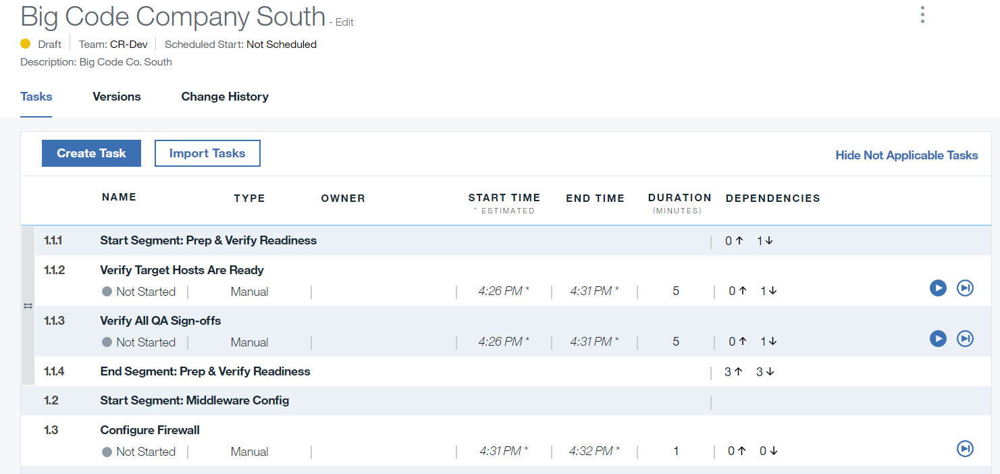
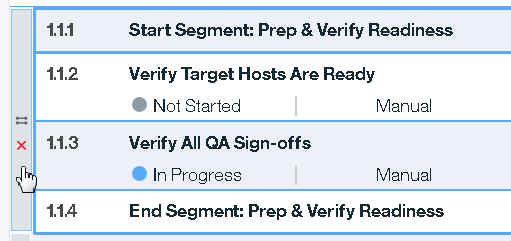
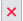
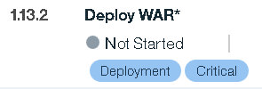
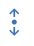
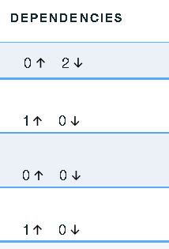

---

copyright:
  years: 2017
lastupdated: "2017-8-8"

---

{:new_window: target="_blank"}
{:shortdesc: .shortdesc}
{:screen:.screen}
{:codeblock:.codeblock}

# Managing tasks
{: #tasks_overview}

A task represents some business-meaningful activity that is associated with a software deployment. Tasks are defined in deployment plans.

{:shortdesc}

Most tasks have a starting and ending point, and a measurable duration.  A task can be of one of following types:

<ul>
<li>A **Manual** task can represent any activity that is associated with a software deployment, such as taking a server offline or updating a database. Users assigned manual tasks can be sent email notifications when their tasks start or fail.</li>
<li>An **UrbanCode Deploy** task represents an IBM&reg; UrbanCode&reg; Deploy application. You can run UrbanCode Deploy applications with this task type.</li>
<li>A **Continuous Delivery pipeline** task represents a {{site.data.keyword.contdelivery_full}} pipeline. You can manage your {{site.data.keyword.contdelivery_short}} pipelines with this task type.</li>
<li>A **Delayed** task represents a critical event that happens at a specific time.</li>
<li>A **Header** task is an organizational element. For example, you might use a header task to identify a task group.</li>
<li>An **Email** task sends an email message when it runs.</li>
<li>A **Run another plan** task runs deployments for other deployment plans participating in the same release event. This is an experimental task type.</li>
<l1>A **Slack** task sends a message to a Slack channel when it runs. </l1>
<l1>A **ServiceNow** can create and manage ServiceNow tickets.</l1>
<l1>A **Wait for approval** pauses a deployment until designated users approve the task.</l1>
</ul>

You can add tasks to deployment plans by creating tasks or you can import tasks from CSV files that are created by IBM UrbanCode Release or another application. You can also copy tasks from other deployment plans. See [Importing tasks](/docs/services/UCCR/UCCR_deployPlan.html#plan_importTasks) for information about the format of the CSV file.

## Creating tasks
{: #tasks_create}

When you create a task, you select the deployment plan where you want to add the task. By default, new tasks are inserted at the bottom of the deployment plan.  After a task is created, you can move it, or copy it and paste it into another deployment plan. [You can also create dependencies with other tasks](/docs/services/UCCR/UCCR_tasks.html#tasks_dependencies).

After you save a task, action icons are displayed for the task. You use action icons to change the task's status during a deployment. All tasks have the **Skip** action icon. Other icons, such as **Start**, are displayed when the context is appropriate for them.

Figure 1. Simple deployment plan with tasks and action buttons

Each task in a deployment plan is contained in a separate row. The information that is displayed for each task is described in the following table.

### Table 1. Task properties

| Property  | Description  |
| ------------------ | ------------------ |
| Name               |Task name       |
| Type               |Type of task: manual, UrbanCode Deploy, Delayed, Header |             
| Status             |Task status: Not started, complete, failed, skipped, not applicable |
| Owner              |Person to whom the task is assigned                                                        |
| Start Time  |Start time or expected start time based on scheduled start, or estimated duration of other tasks        |
| End Time               |Time that the task resolved        |
| Duration               |Length of time from task start to task resolution (time is in minutes)        |
| Dependencies               |Indicates the number of tasks that are prerequisites for the task, and dependent on the task        |

---
After tasks are added to deployment plans, you can manage them in several ways.

To move a task, click anywhere on the task and drag it to a new location.

To copy a task or group, select the task and click **Copy** , and then place the cursor where you want to insert the copied task and click **Paste** .

To cut a task or group from a deployment plan, select the task and click **Cut** .

To delete a task, select the task and click **Delete** . The task is removed from the deployment plan.

## Managing task groups
{: #tasks_groups}

You can combine two or more tasks into a task group. When you create a group, you define the group's execution pattern, sequential or parallel. You can run the tasks in a parallel-pattern group in any order and, unless there are dependencies, simultaneously. The tasks in sequential groups are done in list-order starting with the first or top-most task.

You can embed groups within other groups. You can embed a sequential-pattern group within a parallel-pattern group, and vice versa. However, you cannot embed a sequential-pattern group within another sequential group, or a parallel-pattern group within another parallel group.  

Complete the following steps to create a task group.

1. On the Deployment Plan Detail page, select two or more tasks.

1. Depending on the type of group you want to create, complete one of the following steps.

  <ul>
  <li>To create a parallel group, click the **Parallel** button . If you cannot create a parallel group with the selected tasks, the button is disabled. You might not be able to create a parallel group if all the selected tasks are already in a parallel group, for example.
  </li>
  <li>To create a sequential group, click the **Sequential** button .
  </li>
  </ul>

The group is formed and a **group select bar** is added to the deployment plan. If you selected discontiguous tasks, the tasks form a contiguous list starting with the topmost selected task.

The following figure shows a parallel group. The **group select bar** identifies the type of group: parallel , or sequential .

Figure 2. Parallel group

To move a group, select the **group select bar** or click anywhere on the group, and then drag it to a new location.

To copy a group, select the group and click **Copy** , and then place the cursor where you want to insert the copied group and click **Paste** .

To cut a group, select the group and click **Cut** .

To ungroup a group, select the group and click the **Ungroup** icon  on the **group select bar**.

To delete the tasks in a group, select the group and click **Delete** . The tasks are removed from the deployment plan.

## Managing task tags
{: #tasks_tags}

Tags are organizing elements that you can add to tasks. You can filter deployment plans by tag. For example, during a deployment to a production environment, you might disable tasks with the `DEV_only` tag, which is intended to be used only in development environments.

To add a tag to a task, complete the following steps.

1. On the Deployment Plan Details page, select a task or task group, and then click **Manage Tags**  . You can select multiple tasks and groups.

1. In the Manage Tags for Selected Tasks dialog box, in the **Common Tags** list, select tags. You can create a new tag by typing a name in the list's text box.

1. Click **Save**.

Tags are displayed on the task rows in the Deployment Plan Detail page. In the following figure, the **Deploy WAR** task has two tags assigned to it, `Deployment`, and `Critical`.

The tags used by a deployment plan are displayed on the Deployment Plan Detail page **Versions** tab. To render tasks with a specific tag `Not Applicable` for a deployment, clear the tag. Tasks with the `Not Applicable` status cannot be started.  

Figure 3. Task dependencies

## Creating task dependencies
{: #tasks_dependencies}

You can make a task a prerequisite for other tasks. If a task is a prerequisite, dependent tasks cannot start, even if they are otherwise eligible, until the prerequisite task is resolved.

A task can have multiple dependent tasks and multiple prerequisite tasks. You can define dependencies for a task with any other task in the deployment plan. However, you cannot create circular dependencies. You cannot, for example, make a task dependent on a task that itself depends on the first task.

By controlling task dependencies, you can ensure that events occur in their expected order.

To make a task a prerequisite for other tasks, complete the following steps:

1. On the Deployment Plan Details page, select a task or task group, and then click **Manage Prerequisites** . You can select multiple tasks and groups.

1. In the Manage Prerequisites for Selected Tasks dialog box, in the **Prerequisite tasks for selected tasks** list, select the prerequisite task.

1. Click **Save**.

Task dependencies are shown in the **Dependencies** column on the Deployment Plan Detail page. Up arrows indicate task prerequisites; down arrows indicate task dependencies.

In the following figure, the first task does not have any prerequisites and has two tasks dependent on it. The second task has one prerequisite task and there are no tasks dependent on it.

()

Figure 4. Task dependencies

To review or modify dependencies, select the task and then click  **Manage Prerequisites** . Use the Manage Prerequisites for Selected Tasks dialog box to modify or remove dependencies.
